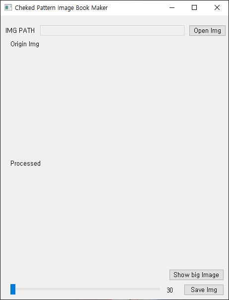
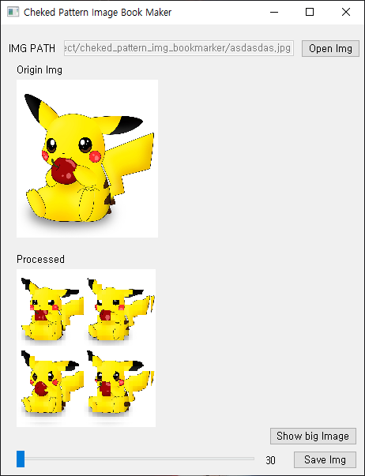
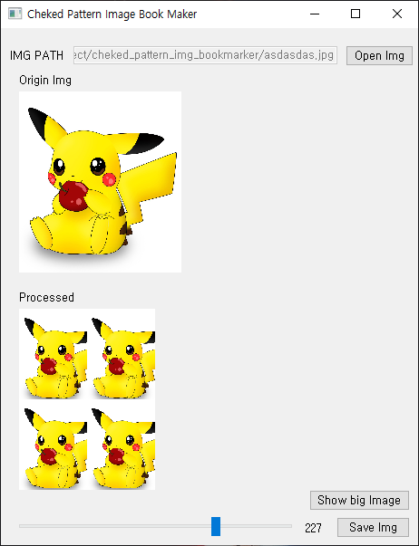
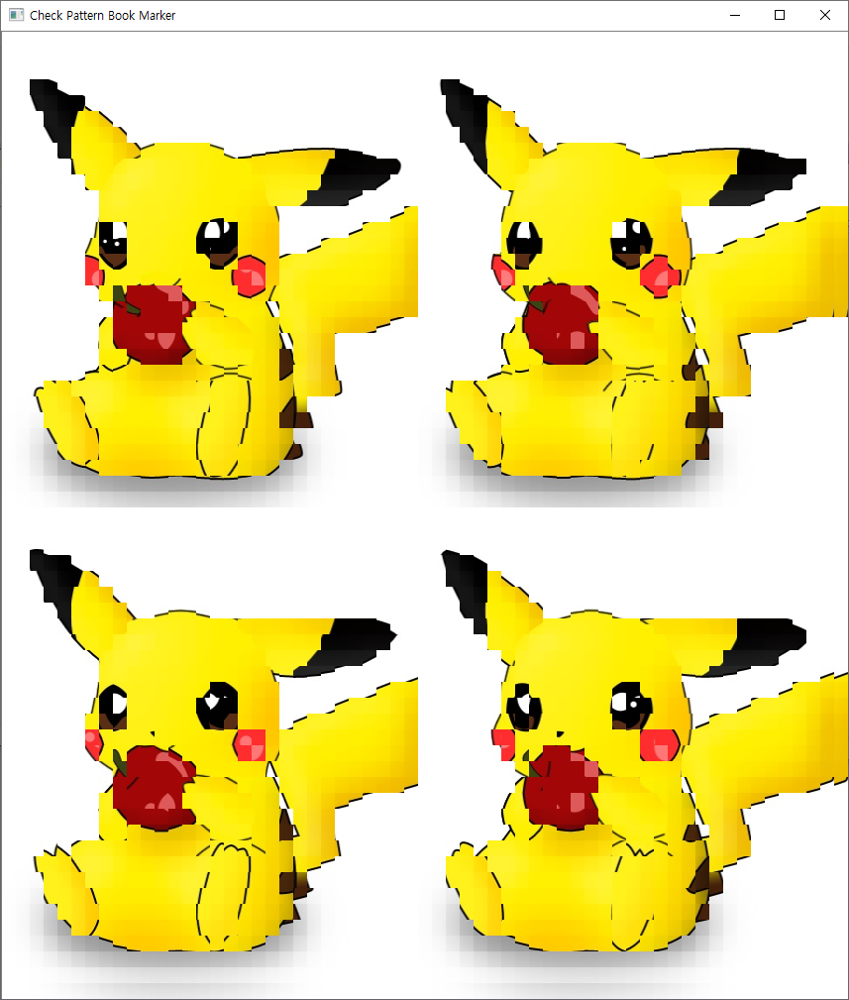

# checked_pattern_img_bookmark

## 사용법

#### git clone 사용시
```
git clone https://github.com/Sihan-Son/checked_pattern_img_bookmark.git
cd checked_pattern_img_bookmark
python bookmark.py
```

#### Download Zip 사용시

checked_pattern_img_bookmark 폴더로 이동  
`cmd` 등에서 

```
python bookmark.py
```




초기 화면



이미지를 불러왔을 시



슬라이더 바를 이용해 단계 조절 가능



원본 사이즈로 보고 싶을 경우
`show big img`를 눌러 주시면 됩니다
 


